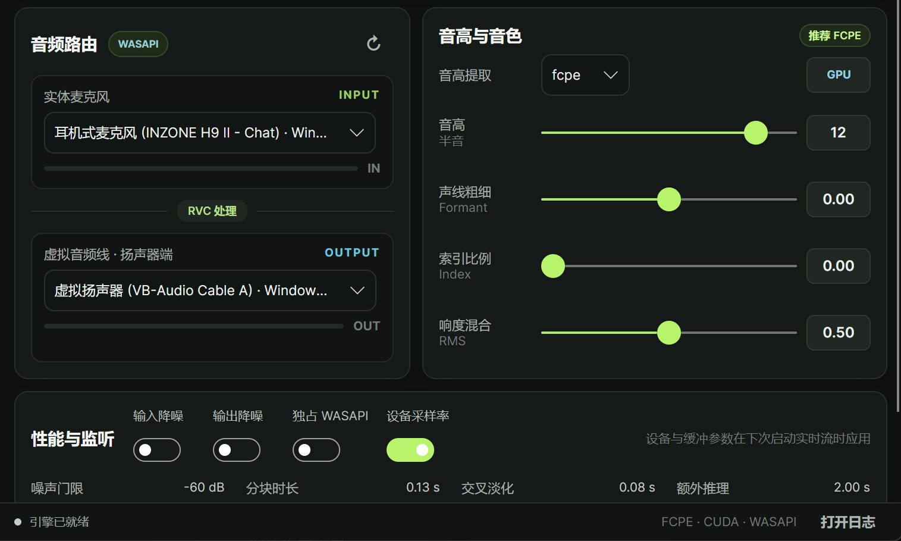

<div align="center">


# RVC Studio

面向 Windows 与 NVIDIA RTX 显卡的一体化本地实时变声工作台

[](https://github.com/3egirlsdream/RvcStudio/releases/latest)
[](#运行要求)
[](#运行要求)
[](LICENSE)

[产品官网](https://3egirlsdream.github.io/RvcStudio/) · [下载安装](#下载安装) · [快速上手](#快速上手) · [参数说明](#参数说明) · [源码开发](#源码开发) · [发布打包](#发布打包)

</div>

## 项目简介

RVC Studio 是一个专注于实时语音转换的 Windows 桌面应用。它将 RVC 推理引擎、CUDA 运行环境、模型资源、WASAPI 音频路由和虚拟声卡安装整合在一起，让用户可以直接把麦克风声音转换为目标音色，并将结果送入 QQ、游戏、直播或录音软件。

桌面客户端使用 Avalonia 与 .NET 10 构建，实时推理由独立 Python 引擎负责。音频帧始终在本机处理，不会上传到账号或更新服务；客户端与引擎只通过带随机令牌的本机回环接口交换控制指令。

本仓库同时包含桌面客户端、RVC/Python 推理源码、兼容的上游 WebUI 入口、Windows 安装器脚本和自动发布工作流。正式安装包是面向 NVIDIA 的实时变声版本，不包含 WebUI 训练界面。

## 应用界面

<div align="center">



<sub>实时音频路由、音高与音色、性能与监听控制</sub>

</div>

## 主要功能

- 原生桌面工作台：统一管理模型、索引、音频设备、实时状态和输入/输出电平。
- 本地实时推理：支持 FCPE、RMVPE 和 PM 音高提取，默认使用 FCPE。
- 音色调节：提供音高、Formant、索引比例、响度混合和噪声门限控制。
- 性能调节：支持分块时长、交叉淡化、额外推理时长、输入/输出降噪、独占 WASAPI 和设备采样率。
- 智能资源选择：选择 `.pth` 模型时会尝试自动匹配同名 `.index` 文件。
- 实时监控：显示 GPU、CUDA、端到端延迟、推理耗时和音频流状态。
- 配置持久化：模型、设备和参数会保存到本机，下次启动自动恢复。
- 完整离线安装：单个安装程序内含应用、Python、PyTorch CUDA 运行环境、默认模型与索引。
- 虚拟声卡集成：安装时可选安装官方标准版 VB-CABLE。
- 账号与使用权益：未开通会员的设备每天可免费使用 1 小时，仅在实时变声开启期间计时；会员有效期内不限时。
- 版本检查：启动后检查新版本，并在有更新时显示版本说明与获取方式。

## 运行要求

| 项目 | 要求 |
| --- | --- |
| 操作系统 | 64 位 Windows 10 22H2（内部版本 19045）或更高版本，包括 Windows 11 |
| 显卡 | NVIDIA RTX 20、30、40 或 50 系列 |
| 显卡驱动 | 兼容 CUDA 12.8；建议 NVIDIA 572.61 或更高版本 |
| 音频输入 | 可被 Windows 识别的麦克风或音频接口 |
| 虚拟音频设备 | 推荐标准版 [VB-CABLE](https://vb-audio.com/Cable/)，安装程序可代为安装 |
| 网络 | 实时变声无需上传音频；账号、会员与版本检查需要联网 |

安装包已经包含 Python、PyTorch 和所需 CUDA 运行库，目标电脑不需要另外安装 Python 或 CUDA Toolkit。

> [!IMPORTANT]
> 当前发布包只面向 NVIDIA RTX 显卡。CPU、AMD 与 Intel 路径仍保留在上游兼容源码中，但不属于 RVC Studio NVIDIA 安装包的支持范围。

## 下载安装

1. 打开 [GitHub Releases](https://github.com/3egirlsdream/RvcStudio/releases/latest)。
2. 在版本说明中点击 Hugging Face 直链，下载单文件 `RVC-Studio-NVIDIA-Setup.exe`。
3. 如需校验完整性，同时下载该 Release 附带的 `SHA256SUMS.txt`，在 PowerShell 中运行：

   ```powershell
   (Get-FileHash .\RVC-Studio-NVIDIA-Setup.exe -Algorithm SHA256).Hash
   ```

4. 运行安装程序并允许管理员权限。安装器会检查 Windows、NVIDIA 驱动、CUDA 运行环境和默认模型。
5. 首次使用且没有虚拟声卡时，保留“安装标准 VB-CABLE”选项。驱动安装完成后按提示重启电脑。

完整安装数据都在这一个 EXE 中，不需要下载额外的 `.bin` 分卷。由于主安装程序尚未使用项目方代码签名证书签名，Windows SmartScreen 可能显示提醒；内置的 VB-CABLE 驱动安装程序保留了 VB-Audio 官方数字签名。

## 快速上手

### 1. 准备音色模型

RVC Studio 使用：

- 必需的 RVC 音色模型：`.pth`
- 可选的特征索引：`.index`

安装包自带可用的默认模型与索引。使用自己的模型时，可以直接通过界面的“浏览”按钮选择；也可以将文件分别放入安装目录的 `assets/weights/` 和 `assets/indices/`。同名文件会被自动匹配，例如：

```text
assets/
├── weights/
│   └── my-voice.pth
└── indices/
    └── my-voice.index
```

### 2. 配置音频路由

标准 VB-CABLE 的推荐路由如下：

| 位置 | 应选择的设备 |
| --- | --- |
| RVC Studio「实体麦克风 / INPUT」 | 你的真实麦克风 |
| RVC Studio「虚拟音频线 / OUTPUT」 | `CABLE Input (VB-Audio Virtual Cable)` |
| QQ、游戏、直播软件的麦克风 | `CABLE Output (VB-Audio Virtual Cable)` |

这里的 `CABLE Input` 是 Windows 播放设备，`CABLE Output` 是其他软件读取的录音设备，名称看似相反但路由关系是正确的。

### 3. 开始实时变声

1. 选择 `.pth` 模型，并按需选择 `.index`。
2. 选择真实输入麦克风和虚拟输出设备。
3. 首次使用建议保留 FCPE 与默认性能参数。
4. 点击“开始实时变声”。
5. 确认界面的 IN/OUT 电平有变化，再进入目标软件测试麦克风。

修改音高、Formant、索引比例、响度混合、门限或降噪时，运行中的引擎会直接应用。修改模型、索引、音频设备、采样率或缓冲参数后，需要停止并重新开始实时变声；切换音频设备时客户端会自动重启实时流。

## 参数说明

| 参数 | 作用 | 调整建议 |
| --- | --- | --- |
| 音高提取 | 在 FCPE、RMVPE、PM 之间切换 | 首选 FCPE；出现特定音色兼容问题时再尝试其他算法 |
| 音高 | 按半音整体升降音高 | 先从 `0` 开始，根据模型训练音域小幅调整 |
| 声线粗细 / Formant | 改变共振峰与声线体感 | 幅度过大可能产生不自然的音色 |
| 索引比例 | 混合 `.index` 检索特征 | 没有索引时保持 `0`；提高后注意咬字与伪影之间的平衡 |
| 响度混合 / RMS | 混合输入与模型输出的响度包络 | 动态不自然时逐步调整，不必一次拉满 |
| 噪声门限 | 低于门限的输入按静音处理 | 环境噪声进入模型时提高门限，吞字时降低门限 |
| 分块时长 | 单次实时处理的音频块长度 | 越短通常延迟越低，但更考验 GPU 和音频驱动稳定性 |
| 交叉淡化 | 相邻音频块的平滑重叠 | 爆音或块边界明显时适当增加 |
| 额外推理 | 为音高与上下文保留更多历史音频 | 增加可能改善连续性，也会增加资源占用和响应时间 |
| 输入/输出降噪 | 在推理前或输出后进行降噪 | 只在确有噪声时启用，避免不必要的音色损失 |
| 独占 WASAPI | 让应用独占所选 WASAPI 设备 | 可降低干扰，但设备将暂时不能被其他程序使用 |
| 设备采样率 | 使用输入设备默认采样率而非模型采样率 | 遇到设备不支持模型采样率时启用 |

不同模型、麦克风、声卡和 GPU 的最佳参数不同。建议先确认默认参数下链路正常，再一次只修改一个参数。

## 使用额度与本地数据

未开通会员时，同一设备每天有 1 小时免费实时变声额度，只有实时音频流处于运行状态时才会计时，并在本地时间次日 `00:00` 刷新。登录、退出或切换免费账号不会重置当天设备额度。会员在有效期内不限时。

本地配置和运行数据位于：

```text
%LOCALAPPDATA%\RvcStudio\
├── config.json                 # 模型、设备和实时参数
├── account.dat                 # Windows 用户加密保护的登录会话
├── usage.dat                   # Windows 用户加密保护的当日用量
└── logs\
    └── rvc-studio-engine.log   # 后台引擎日志
```

不要手动修改用量文件或回拨系统时钟；完整性校验失败时，当天免费额度会被暂停。账号登录和支付功能适用界面中链接的用户协议与隐私协议。

## 常见问题

### 启动时提示未检测到 CUDA GPU

确认电脑使用受支持的 NVIDIA RTX 显卡，并升级到兼容 CUDA 12.8 的 NVIDIA 驱动。远程桌面、虚拟机或被系统禁用的独立显卡也可能导致 CUDA 不可用。

### 看不到 VB-CABLE 设备

确认安装时勾选了 VB-CABLE，并在驱动安装后重启 Windows。随后点击 RVC Studio 音频路由区域的刷新按钮。已经打开设备列表的 QQ、游戏或直播软件也可能需要重新启动。

### 界面有输入电平，但目标软件没有声音

检查 RVC Studio 的输出是否为 `CABLE Input`，目标软件的麦克风是否为 `CABLE Output`。如果仍无声音，先关闭“独占 WASAPI”，并确认 Windows 没有将虚拟设备静音。

### 声音断续、爆音或延迟过高

先关闭不必要的 GPU 程序和输入/输出降噪，恢复默认缓冲参数。断续时可逐步增加分块时长或交叉淡化；稳定后再尝试降低分块时长以减少延迟。

### 修改参数后没有生效

界面会提示哪些设置需要重启实时流。模型、索引、设备、采样率和缓冲相关设置需要停止后重新开始；音高、Formant、索引比例、响度、门限和降噪可热更新。

### 引擎启动失败或意外断开

点击界面底部的“打开日志”，或直接查看 `%LOCALAPPDATA%\RvcStudio\logs\rvc-studio-engine.log`。提交 Issue 时请附上应用版本、Windows 版本、GPU 型号、驱动版本和已去除隐私信息的日志片段。

## 源码开发

### 开发环境

- Windows 10/11 x64
- [.NET SDK 10.0.303](https://dotnet.microsoft.com/download/dotnet/10.0)（仓库由 `global.json` 固定版本）
- GitHub CLI `gh` 与 7-Zip（用于恢复未纳入 Git 的大型运行依赖）
- NVIDIA RTX 显卡与兼容驱动（实际实时推理和 CUDA 验证）

### 恢复依赖并运行桌面端

大型 Python/CUDA 运行环境和模型不进入 Git，而是保存在 `build-dependencies-v1` Release 中。克隆仓库后执行：

```powershell
git clone https://github.com/3egirlsdream/RvcStudio.git
Set-Location RvcStudio

.\packaging\Restore-BuildDependencies.ps1 -Repository 3egirlsdream/RvcStudio
dotnet restore .\studio\RvcStudio.App\RvcStudio.App.csproj
dotnet run --project .\studio\RvcStudio.App\RvcStudio.App.csproj
```

桌面程序启动时会向上查找仓库根目录中的 `runtime/pythonw.exe` 和 `realtime_service.py`。如果缺少这两个文件，说明大型依赖尚未正确恢复。

源码仓库还保留两个兼容入口，供研究和调试上游功能使用：

```powershell
.\go-webui.bat          # 上游兼容 WebUI、离线推理与训练
.\go-realtime_gui.bat   # 旧版实时 GUI 备用入口
```

它们不属于正式 RVC Studio 实时版安装包的交付内容。

### 项目结构

```text
RvcStudio/
├── studio/RvcStudio.App/       # Avalonia/.NET 桌面客户端
├── engine/                     # 无界面实时音频引擎与本机控制服务
├── infer/                      # RVC、HuBERT、RMVPE、FCPE 推理实现
├── configs/                    # RVC 与实时引擎配置
├── tools/                      # 音频处理、CUDA Graph、降噪等工具
├── train/                      # 上游兼容训练流程
├── packaging/                  # 安装器、依赖恢复、校验与发布脚本
├── realtime_service.py         # RVC Studio 后台引擎入口
├── realtime_gui.py             # 旧版实时 GUI
└── webui.py                    # 上游兼容 WebUI
```

实时音频和 CUDA 对象全部由 Python 引擎单独持有，音频帧不会跨越 .NET/Python 进程边界；桌面端只负责配置、状态查询和生命周期管理。

## 发布打包

发布版本号定义在 [`studio/RvcStudio.App/RvcStudio.App.csproj`](studio/RvcStudio.App/RvcStudio.App.csproj) 的 `<Version>` 中。完整发布构建还需要 Inno Setup 6.5 或更高版本，并建议预留至少 15 GiB 可用磁盘空间。

先做只读预检：

```powershell
.\Build-Package.cmd -PreflightOnly
```

本地构建请显式跳过更新服务器版本发布：

```powershell
.\Build-Package.cmd -SkipVersionPublish
```

输出位于 `packaging/output/installer/`，其中 `RVC-Studio-NVIDIA-Setup.exe` 是完整单文件离线安装包。更详细的参数、暂存目录、VB-CABLE 签名检查和 CI 发布流程见 [`packaging/README.md`](packaging/README.md)。

推送到 `main` 后，GitHub Actions 会比较客户端与更新服务器版本；仅当客户端版本更高时才恢复已校验依赖、构建并验证安装器、上传单文件安装包到 Hugging Face、发布 GitHub Release，最后更新版本服务。

## 反馈与参与

- 问题与建议：[GitHub Issues](https://github.com/3egirlsdream/RvcStudio/issues)
- 版本发布：[GitHub Releases](https://github.com/3egirlsdream/RvcStudio/releases)
- 官方 QQ 群：`791129392`

提交代码前请确保没有把 `runtime/`、模型权重、构建输出、账号数据或日志加入 Git。功能改动至少应完成对应项目构建；涉及实时引擎、CUDA 或安装器时，还应执行相应的启动或发布预检。

## 许可证与使用责任

本项目代码沿用 [MIT License](LICENSE)。第三方组件、模型和驱动仍分别受其自身许可证或分发条款约束，安装包内同时提供第三方声明与对应许可证文件。

请只使用已获得授权的音色模型、训练数据和声音素材，并在适用场景中明确告知语音经过合成或转换。使用者需自行承担模型、输入内容、转换结果及传播行为所产生的法律与伦理责任。

## 致谢与引用

RVC Studio 基于 [RVC-Project/Retrieval-based-Voice-Conversion-WebUI](https://github.com/RVC-Project/Retrieval-based-Voice-Conversion-WebUI) 开发。感谢 RVC 原项目作者、维护者和[所有贡献者](https://github.com/RVC-Project/Retrieval-based-Voice-Conversion-WebUI/graphs/contributors)提供的模型架构、推理与训练实现；默认基础资源来自 [lj1995/VoiceConversionWebUI](https://huggingface.co/lj1995/VoiceConversionWebUI)。本项目的桌面工作流、独立实时服务、安装打包和发布体系建立在这些成果之上。

如果在研究、文章或衍生项目中使用本仓库，请至少保留对 RVC 原项目的链接与许可证声明。可使用以下软件引用：

```bibtex
@software{rvc_project,
  author  = {{RVC Project}},
  title   = {Retrieval-based Voice Conversion WebUI},
  url     = {https://github.com/RVC-Project/Retrieval-based-Voice-Conversion-WebUI},
  license = {MIT}
}
```

同时感谢以下原项目及关键组件：

- [ContentVec](https://github.com/auspicious3000/contentvec/)
- [VITS](https://github.com/jaywalnut310/vits)
- [HiFi-GAN](https://github.com/jik876/hifi-gan)
- [RMVPE](https://github.com/Dream-High/RMVPE)，以及预训练模型训练与测试贡献者 [yxlllc](https://github.com/yxlllc/RMVPE) 和 [RVC-Boss](https://github.com/RVC-Boss)
- [FFmpeg](https://github.com/FFmpeg/FFmpeg)
- [Ultimate Vocal Remover](https://github.com/Anjok07/ultimatevocalremovergui)
- [pymss](https://github.com/pymss-project/pymss)
- [audio-slicer](https://github.com/openvpi/audio-slicer)
- [PyTorch](https://github.com/pytorch/pytorch)、[Avalonia](https://github.com/AvaloniaUI/Avalonia) 与 [VB-CABLE](https://vb-audio.com/Cable/)

<a href="https://github.com/RVC-Project/Retrieval-based-Voice-Conversion-WebUI/graphs/contributors">
  
</a>
